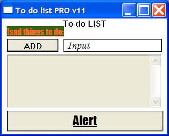

# Event-Driven Programming Laboratory Work #1

## Title

Window. Window handling. Basic window’s form elements

## Contents

* Win32 API
* `git`
* Programming Style Guidelines
* Window
* Button
* Text Input
* Text

## Completed Mandatory Objectives:

* Choose a _Programming Style Guideline_ that you'll follow
* Create a `Windows application`
* Add 2 `buttons` to window: one with default styles, one with custom styles (size, background, text color, font family, font size)
* Add 2 `text` elements to window: one with default styles, one with custom styles (size, background, text color, font family, font size) *[one of them should be something funny]*
* On windows resize, one of the `text`s should "reflow" and be in window's center (vertically and horizontally)

## Completed Objectives with additional points:

* Add 2 text inputs to window: one with default styles, one with custom styles (size, background, text color, font family, font size) `(1pt)`
* Make elements to fit window on resize `(1 pt)`
* Change behavior of different window actions (at least 3). For ex.: on clicking close button, move window to a random location on display's working space `(1 pt)`

## The application

For creating this app I've read the chapters that where specified in the task of the lab and also the [www.MSDN.com](http://msdn.microsoft.com/en-US/) website for and advance look. 

For developing the project, I've used the CodeBlocks IDE. The project can be simply compiled having the ** *.cbp ** file and the resource ** *.cpp **.  

The Window has a minimal size which was set using the WM_GETMINMAXINFO message processing.  
The 'Text' / 'Button' / 'Input' has a custumized style becouse the 'CreateFont()' function was used.
The elements fill the window on resize using the WM_SIZE message processing.
The app redraws the entire window if a movement or size adjustment is made, because the style of the class: CS_HREDRAW | CS_VREDRAW.

If you click the 'Alert' button, you can remove it by selecting 'YES' from the message box that appeared.

If you click the 'X' button from the 'Title bar', the app won't close. Even with Alt+F4 it prompts a message box, then another one.

Maximize and minimize work by default.

If you type the word 'exit' in the input field then the app will close.
