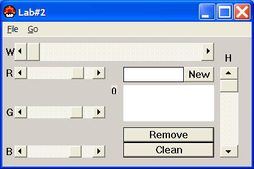
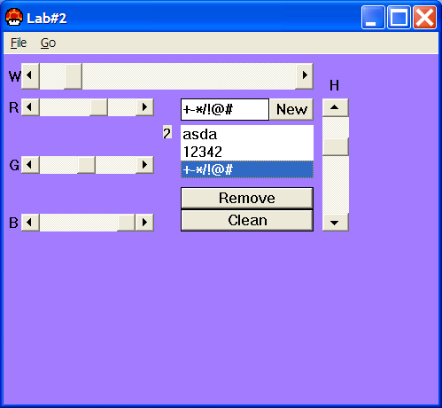

# Event-Driven Programming Laboratory Work #2

## Title

Advanced Form Elements. Child Windows. Basics of Working With Keyboard.

## Contents

* The Keyboard
* Child Window Controls
* Scroll Bar
* Listbox
* Menus and Other Resources
* Dialog Boxes

## Completed Mandatory Objectives:

* Display a dialog box on some event (ex. on clicking some button)
* Add a system menu to your application with at least 3 items (add actions to that items)
* Add a scroll bar that will change any visible parameter of any other element (3 scrollbars for background color)
* Hook keyboard input. Add 2 custom events for 2 different keyboard combinations (close on ctrl+space; hide or show window on alt+enter)

## Completed Objectives with additional points:

* Add a listbox and attach some events when any element is accessed (clicked) `(2 pt)`
* Add 2 scroll bars that will manage main window **size** or position `(1 pt)`
* Customize your application by adding an icon and using different cursor in application `(1 pt)`

## The application

For creating this app I've read the chapters that where specified in the task of the lab and also the [www.MSDN.com](http://msdn.microsoft.com/en-US/) website for and advanced look. 

For developing the project, I've used the CodeBlocks IDE. The project can be simply compiled having the ** *.cbp ** file and the resource ** *.cpp **.  

