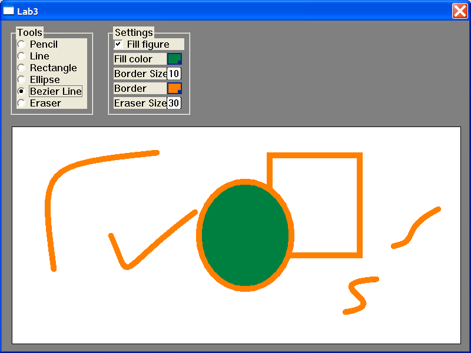

# Event-Driven Programming Laboratory Work #3

## Title

Basics of Working with Mouse. GDI Primitives. Bezier Curve.

## Contents

* Mouse
* Device context
* GDI Primitives
  * Line
  * Curve
  * Plane
  * Bitmap image
* Bezier curve

## Completed Mandatory Objectives:

* Draw few lines of different colors and weights
* Draw a Bezier curve
* Draw few plane objects (ex. circle, square, pie, polygon...) of different colors, weights, filled and not
* Draw 2 different objects using mouse

## Completed Objectives with additional points:

* Draw a custom bitmap image `(1 pt)`
* Add a switch (button, select list...) that will change mouse ability to draw objects `(2 pt)`
* Draw a Bezier curve using mouse `(1 pt)`
* Use mouse as an eraser of:
  * a fixed width `(1 pt)`
  * a adjustable width `(2 pt)`

## The application

For creating this app I've read the chapters that where specified in the task of the lab and also the [www.MSDN.com](http://msdn.microsoft.com/en-US/) website for and advance look. 

For developing the project, I've used the CodeBlocks IDE. The project can be simply compiled having the ** *.cbp ** file and the resource ** *.cpp **.  

