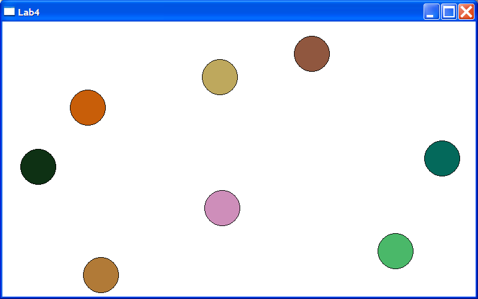

# Event-Driven Programming Laboratory Work #1

## Title

Windows Timer. Animation.

## Contents

* Windows timer

## Completed Mandatory Objectives:

* Create an animation based on Windows timer which involves at least 5 different drawn objects

## Completed Objectives with additional points:

* Increase and decrease animation speed using mouse wheel `(2 pt)`
* Add animated objects which interact with each other `(2-6 pt)`, ex.:
  * With right click you can delete objects
  * Balls have different velocity and colors
  * Balls bounce of the margins
  * Balls travel across entire window area, even when it is resized.

## The application

For creating this app I've read the chapters that where specified in the task of the lab and also the [www.MSDN.com](http://msdn.microsoft.com/en-US/) website for and advance look. 

For developing the project, I've used the CodeBlocks IDE. The project can be simply compiled having the ** *.cbp ** file and the resource ** *.cpp **.  

