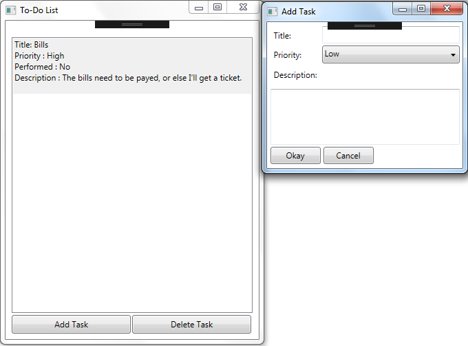

# Event-Driven Programming Laboratory Work #6

_This laboratory work should be done using `C#`._

## Title
Developing using C#. WinRT

## Contents
* C#
* WinRT

## Completed Mandatory Objectives
* Create an Win32 application using C#
* Create a ToDo list. Should contain:
  * A list of tasks
  * A way to add new tasks from UI

## Completed Objectives With Points
* Create a report `(3pt)`

## The application

For creating this app I've read the chapters that where specified in the task of the lab and also the [www.MSDN.com](http://msdn.microsoft.com/en-US/) website for and advance look. 

For developing the project, I've used the VisualStudio IDE. The project can be simply compiled having the ** *.csproj ** file and the resource ** *.cs **.  

* Add / Delete elements in list with [Add Task] / [Delete Task] buttons
* [Add Task] button creates a new child window with fields for the new element (title, priority, description)

